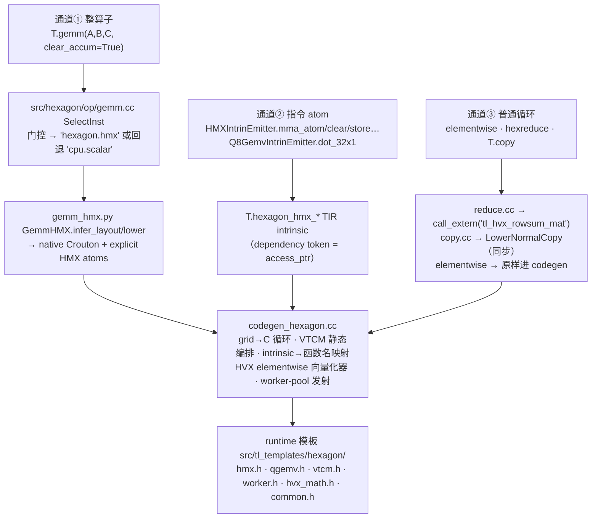

# TileLang × Hexagon 走读：kernel 实现与编译器对接

日期：2026-08-14。读者：要学习/接手本后端的工程师。范围：**kernel 实现层**（`src/tl_templates/hexagon/` 的 runtime 模板 + 生成的 C）与**编译器对接层**（tileop 选择 → lowering → codegen）。所有行号以当前 `hexagon-backend` 分支为准。

与[开发计划](hexagon_operator_plan.md)六工作流的对应：本文 §2.4/§3.2–3.4 = 工作流 1、3 的实现现状（HMX 原语 + Crouton）；§2.5/§3.5/§3.6 = 工作流 4（HVX）；§2.3 与 §3.5 的 worker-pool = 工作流 5；§3.6 的 `copy.cc` 就是工作流 2 要改造的对象（当前同步）。

---

## 1. 总设计：薄 codegen、厚 runtime

`hmx.h` 文件头一句话概括了整个后端的分工（`src/tl_templates/hexagon/hmx.h:2`）：

> All the HMX/HVX/VTCM/Crouton hardware intimacy lives here; **the codegen stays a thin C emitter that just calls into it.**

即：**硬件的复杂性沉在手写的 runtime 模板头文件里；编译器只负责把 TIR 打印成"调这些函数的 C 循环"**。看一个真实生成物就明白生成的 C 有多薄（`examples/hexagon/llama_cpp_integration/kernel_qgemv_q8_0_k2048.c`，全文 23 行）：

```c
// tilelang Hexagon (cDSP) kernel
#include <tl_templates/hexagon/common.h>
extern "C" int32_t qgemv_q8_0_k2048_kernel(uint8_t* weight, uint8_t* activation,
                                           float* bias, float* dst) {
  for (int bx = 0; bx < 1; ++bx)
    ... // 退化的 grid 循环
      tl_hexagon_q8_0_dot_32x1(2048, &dst[0], &weight[0], &activation[0], 32, &bias[0]);
  return TL_OK;
}
```

DSL 到硬件有**三条 lowering 通道**，汇合在 codegen，最终都落到 runtime 模板：



---

## 2. kernel 实现层：`src/tl_templates/hexagon/` 逐文件

| 文件 | 行数 | 一句话定位 |
|---|---|---|
| `common.h` | 85 | 类型词汇表（`half`、`floatN` 向量）+ 状态码 ABI（`TL_OK/TL_ERR_*`） |
| `vtcm.h` | 91 | 一次 acquire 的 VTCM arena + 2 KB 对齐 + high-water 契约 |
| `worker.h` | 161 | 6 硬件线程的持久 worker 池（`tl_parallel`） |
| `hmx.h` | 616 | HMX session/锁、历史 pack/unpack/GEMM helper、当前显式 atom wrapper |
| `qgemv.h` | 114 | Q8_0 的 `vrmpyacc` dot atom（刻意只做 dot） |
| `hvx_math.h` | 334 | HVX lane 原语（widen/narrow、rsqrt、exp2、行归约） |
| `qmatmul.h` | 198 | Q4 路径的辅助（历史 monolithic 路线） |
| `tl_bridge.h` / `tl_embed.h` | 31/95 | 嵌入 llama.cpp 的"骑资源"桥（Mode B） |

### 2.1 `common.h` —— 为什么 DSL 位运算能自动变成 HVX

生成代码里的 `half8`/`uint8_t128` 等类型是模板 `vec_type<T,N>`，**内部是 clang 原生 `ext_vector_type`**（`common.h:42-62`）：逐元素 `+ - * / & | ^ << >>` 直接落到向量指令，由 hexagon-clang++ 映射到 HVX。这就是"DSL 里写 `(int16)(q & 0xF) - 8) * s`，codegen 不做任何事，出来就是 HVX 反量化"的机制。`aligned(1)` 是有意的：VTCM merge pass 按元素而非 128 B 打包 tile，非对齐只影响 load/store 形式（vmemu），不影响向量化。另外这里定义了**内核状态码 ABI**：kernel 返回 `int32_t`，非零被 FastRPC skel 映射为 `AEE_EFAILED`，宿主 `run()` 抛异常而不是静默拿到半截输出（`common.h:18-25`）。

### 2.2 `vtcm.h` —— arena 与两个不变量

- **整块 acquire 一次**（`tl_vtcm_acquire`，幂等），alloc_shared 与 HMX scratch 共用一个 arena，避免双重申请。
- **arena 基址强制 2 KB 对齐**（`vtcm.h:33-36`）：HMX activation/output 地址要求 2 KB 对齐，weight 要求 128 B；arena 先满足最严格的基址约束，子分配再由 planner 按 operand 对齐。这是很多"静默垃圾"问题的根源。
- **`tl_vtcm_shared_high_water`**（`vtcm.h:27-31`）：codegen 自底向上给 alloc_shared 分偏移并发布水位；HMX gemm 的 Crouton scratch 从顶向下生长，越界就返回 `-3` 拒绝，而不是覆盖活着的 tile。

### 2.3 `worker.h` —— 工作流 5 的现有底座

`tl_parallel(fn, ctx, nw)`：worker 0 跑在**调用线程**上，1..nw-1 用**持久 qurt 线程池**（懒生成一次，空闲时阻塞在信号量上，因此每次派发只花一对 sem up/down，不是线程 spawn+join —— 后者曾主导小算子耗时）。两个关键设计（`worker.h:5-16`）：

- **从不 `qurt_hvx_lock`**：worker 数 ≤ 硬件线程数（= HVX context 数），QuRT 隐式给每个线程分配 HVX context，不会超订。
- worker 返回码 **OR-规约**回入口（`worker.h:128-134`），单个 worker 的失败（如 HMX enable 失败）会变成整个 kernel 的非零返回。

### 2.4 `hmx.h` —— 五块看懂 HMX（工作流 1、3 的实现现状）

1. **session 与锁**（`hmx.h:42-128, 305-354`）：power（DCVS 拉到 TURBO_L3 + HMX 上电）→ VTCM → HMX ctx（`HAP_compute_res` + 每线程 `hmx_lock2(SHARED)`）。此外有一把手写汇编 spinlock（`memw_locked`，`hmx.h:109-128`）——因为 **HMX 累加器是全芯片一个物理寄存器组**，clear→MAC→读出必须整段互斥。init 失败会整体回滚并让 `_open` 大声失败，避免"HMX 从未锁上、每次 MAC 算出零"的静默模式。
2. **Crouton 布局**（`hmx.h:178-190`）：一个 32×32 tile 内 `(i,j)` 的元素位置是

   ```c
   cpos(i,j) = (i & ~1)*32 + j*2 + (i & 1)   // 行对交织（row-pair interleave）
   ```

   这一个公式就是"布局是 ABI"的核心：DSL 侧 `hmx_intrin.py` 的 `T.Layout` forward 函数（`((m%32)//2)*64 + (k%32)*2 + m%2`）与它**逐 bit 一致**，两处必须同步改。
3. **HVX 快速 pack/unpack**（`hmx.h:203-270`）：行对交织恰好等于一条 `vshuff`——两行源数据一条指令变成一个 row-pair 跨度（比逐元素 pack 快约 64×）；unpack 用 `vdeal` 逆变换。要求连续维是 64 的倍数，否则回退共享的标量 pack（转置操作数也走标量——这是已标注的后续优化点，`hmx.h:271-275`）。
4. **当前 `T.gemm` 入口是 emitter**：`GemmHMX.infer_layout` 给 A/B/C 分配 native Crouton，`lower` 直接编排下一项的 atoms；shared-memory planner 按 operand 传播 A/C 2 KB、B 128 B、config 256 B 对齐，每个结果直接写入最终 C tile。`tl_hexagon_hmx_gemm` 与 top-down scratch 保留给历史/手写路径，不再是 TileLang `T.gemm` 的 lowering 结果。
5. **显式 atom**（`hmx.h:410-473`）：`tl_hexagon_hmx_acc_acquire/load_bias/clear_acc/mma_atom/convert_acc/store_cvt_state`——每个只包一条硬件协议操作。签名里的 `void *acc_state` 等参数**在 C 里全部 `(void)` 丢弃**：硬件状态本来就是隐式的，这些 token 只存在于 TIR 层，用来向编译器分析表达顺序与存活期（比如把 activation/weight 源指针一路携带到 store，阻止 shared-memory planner 在 HMX 流水线还占用它们时回收缓冲区，`hmx.h:457-473`）。

### 2.5 `qgemv.h` —— atom 的分层宣言（工作流 4 的样板）

文件头就是设计原则（`qgemv.h:4-7`）：**这个头刻意只做到 32 输出的 dot atom 为止**；DMA descriptor 所有权、VTCM 缓冲、activation 量化、worker 调度都是"操作/运行时层"的事——所以 llama.cpp 集成时才能把 seam 放在 `dma_queue_pop()` 之后、只替换 dot。核心是 `Q6_Vw_vrmpyacc_VwVbVb`：一条指令并行完成 32 个 signed-int8 点积（`qgemv.h:36-49`），配 `vshuff/vror` 把两条相邻 128 B weight 向量重排成每输出行 4 个连续 K 字节。tile ABI（1024 quant + 128 scale/padding = 1152 B）用宏钉死，与 Python 侧 `Q8_0TiledLayout` 一致。

---

## 3. 编译器对接层：一次 `tilelang.compile(target="hexagon")` 经过哪里

### 3.1 注册（`tilelang/hexagon/pipeline.py`，32 行）

pass pipeline **原样复用 CPU 的**（`register_pipeline(PassPipeline("hexagon", CPUPassPipelineBody))`）：Hexagon kernel 是"顺序 C + intrinsics"，GPU 式 grid/threads 和 CPU 后端一样降成普通循环。gemm 注册是**双侧**的：C++ 侧管"选哪个实现"，Python 侧管"怎么 lower"（`GemmScalar` 与 `GemmHMX` 都注册在 `hexagon` target 下）。

### 3.2 指令选择（`src/hexagon/op/gemm.cc:39-45`）

```cpp
bool hmx_ok = fp16(A) && fp16(B) && fp16(C) && M%32==0 && N%32==0 && K%32==0
           && A/B/C 都是 2D && 都是 shared(VTCM) && clear_accum 恒为 true;
return hmx_ok ? "hexagon.hmx" : "cpu.scalar";
```

不满足门控就**回退标量三重循环**（hexagon-clang 自动向量化到 HVX）——尤其是默认 `clear_accum=False` 的累加式 K-loop 和 fragment 操作数，HMX 路径还不支持，但用户代码依然能跑对。这是"每层都能拒绝"哲学的第一层。

### 3.3 通道①的 Python lower（`tilelang/hexagon/gemm_hmx.py`）

两个设计决策值得记住：

- **`infer_layout` 返回 A/B/C 的 native Crouton layouts**；storage transpose 通过坐标复合表达，物理 HMX tile 不变。一次逻辑 FP16 `T.copy` 可以由 `src/hexagon/op/copy.cc` 识别为带 stride 的 DDR/VTCM <-> native VTCM Crouton pack/unpack；后续 DMA 可以在同一 copy plan 中替换 row-major transfer 阶段。
- **`lower` 只接收 A/B/C**：内部准备 scale/bias 和 dependency tokens，并生成 `acquire -> for mt -> for nt -> clear -> for kt mma_atom -> convert -> store_C_tile -> release`。shared-memory planner 从各 HMX intrinsic 的对应参数传播 A/C 2 KB、B 128 B、config 256 B 对齐到最终 VTCM 子分配；full-region 与 `clear_accum=True` 仍是防御条件。

### 3.4 通道②：atom 怎么从 DSL 走到 C（`hmx_intrin.py` → codegen）

`HMXIntrinEmitter` 每个方法 **build 并返回一个嵌套 `@T.macro`**（铁律：否则 VTCM liveness pass 看不到 scratch 的使用，缓冲区会被别名——静默垃圾），宏体发射 `T.hexagon_hmx_*` TIR intrinsic，参数全部是 `T.access_ptr`（含 dependency token）。codegen 里只有一张**名字映射表**（`codegen_hexagon.cc:428-455`）：

| TIR intrinsic | 生成的 C 调用（hmx.h） |
|---|---|
| `hexagon_hmx_acquire/release` | `tl_hexagon_hmx_acc_acquire/_release` |
| `hexagon_hmx_load_bias` | `tl_hexagon_hmx_load_bias` |
| `hexagon_hmx_clear` | `tl_hexagon_hmx_clear_acc` |
| `hexagon_hmx_mma` | `tl_hexagon_hmx_mma_atom` |
| `hexagon_hmx_convert` | `tl_hexagon_hmx_convert_acc` |
| `hexagon_hmx_store` | `tl_hexagon_hmx_store_cvt_state` |

三个 `make_hmx_*_layout` 的 `T.Layout` forward 函数就是 §2.4 的 cpos 公式在 Python 侧的镜像（`hmx_intrin.py:64-109`）——Q4 kernel 的显式 dequant 之所以能"逻辑坐标写入、物理落到 Crouton"，全靠它。**给新指令族加原语的套路照此**：runtime 写 atom（可单测）→ 定义 TIR op → emitter 发射 → codegen 加一行映射。

### 3.5 codegen 本体（`src/hexagon/codegen/codegen_hexagon.cc`，873 行）

按职责分五块读：

- **函数发射 `AddFunction`（125-360）**：两条路径。串行路径把 grid 直接降成嵌套 for（`thread_extent` 处理在 492-538）。**worker-pool 路径**（`hexagon.num_workers` attr > 0）发射五件东西：① 预扫描 TIR 统计每 worker 的 VTCM 需求（alloc_shared 操作数 + gemm Crouton scratch 取 max → `wp_stride_`，200-252）；② 参数打包 struct；③ `_worker` 回调（按需 per-thread HMX enable，失败返回 `TL_ERR_HMX`）；④ 把 **blockIdx.x 循环条带化**：`for (bx = tl_wid; bx < extent; bx += tl_nw)`（516-523）；⑤ 入口按**运行时实际 VTCM 授予量**削减 worker 数，一个 region 都放不下就返回 `TL_ERR_VTCM`（319-338）。没有 blockIdx.x 网格循环的 num_workers kernel 会被 ICHECK 拒绝——否则每个 worker 会重复整个网格并产生写竞争。
- **VTCM 静态编排 `VisitStmt_(AllocBufferNode)`（362-415）**：shared scope 的缓冲**编译期**分配固定偏移：`(T*)((char*)tl_vtcm_base() + offset)`，偏移从 2048 起（**首个 2 KB tile 保留给 HMX 输出 scale**，133）、按 2 KB 对齐递增、随手发布 high-water；worker 模式额外加 `tl_wid * wp_stride_`。整个内存规划没有运行期分配器——编译期算好，运行期只查界。
- **worker 模式 HMX 识别**：预扫描同时识别 HMX TIR intrinsic 和历史 `tl_hexagon_hmx_gemm`。当前 emitter atoms 使用每 worker 已静态分配的 shared buffers，不需要 `_mt` top-down scratch 重写。
- **HVX elementwise 向量化器（564-870）**：这是"{gemm, copy, map, reduce} 基"里 **map** 的实现，也是工作流 4 最该精读的部分。动机：Hexagon 标量单元没有 fp16，标量循环会编译成逐元素 libcall（`__extendhfsf2`）。`TryEmitHvxElementwise` 识别规范形态——最内层 `for j in [0,N)`、N 是 64 的倍数、单条 fp16 标量 store、下标对 j 单位步长——然后按 64 列一组发射：`widen fp16→fp32(lo,hi) → fp32 计算 → narrow 回 fp16`。实现上先跑一遍 **probe（emit=false）** 确认整棵表达式树可发射，再真正 emit，保证不会发射一半再回退。还内置惯用法识别：`1.0/sqrt(x)` → `tl_hvx_rsqrt_vsf`（一条指令且更准）、`exp(x)` → `exp2(x·log2e)`；j 无关子式求值一次后 splat；对齐可证明时用对齐 load/store，否则 `vmemu`。不匹配的整体回退 CodeGenC 标量循环。
- **杂项**：`PrintType` 支持到 128 lane（HVX 一寄存器 = 128×int8/64×fp16/32×fp32）；`Broadcast` 发射 `((float4)(v))` 的 splat 构造。

### 3.6 通道③的另两个 tileop：reduce 与 copy

- **`reduce.cc`（hexreduce 的落地）**：为什么必须是 tileop——stock `T.reduce_sum` 走 register fragment，Hexagon 推不了。约束清单写得很清楚（40-66）：仅 2D、dim=1、clear=True、fp16 源/fp32 目标、**源必须整 buffer**（`MakeAccessPtrFromRegion` 会丢 2D 子区域偏移，子区域会静默读错行——所以 ICHECK 拒绝）。落到 `tl_hvx_rowmax_mat/rowsum_mat`。
- **`copy.cc`：当前就是 `LowerNormalCopy`（同步逐元素）**——这 58 行就是**工作流 2 的改造对象**：异步 DMA 版要在这里选 1D/2D descriptor 并接工作流 6 的 commit/wait hook。

### 3.7 出口

生成的 C 以 `extern "C"` + `int32_t` 状态码收尾，由 `_fastrpc.py` 包成 FastRPC 工程（skel 把非零映射为 `AEE_EFAILED`）；或者由 `kernel.get_kernel_source()` 直接取走嵌入 llama.cpp（Mode B，见[对接 walkthrough](lfm2_hexagon_report/tilelang_operator_integration.md)）。

---

## 4. 跨层设计约定（写新代码前先内化）

1. **薄 codegen、厚 runtime**：新指令族的正确姿势是先写 runtime atom（可脱离编译器单测），再加 TIR op + emitter + codegen 一行名字映射。不要把硬件序列拼在 codegen 的字符串流里。
2. **拒绝优于静默**：每一层都有拒绝手段——SelectInst 回退 scalar、Python lower `raise NotImplementedError`、tileop `ICHECK` 带改法提示、runtime 返回 -1/-2/-3、kernel 状态码让 host `raise`。设备上最贵的 bug 是静默垃圾，本仓库的所有检查都是被真实事故换来的。
3. **布局是 ABI**：Crouton 的 cpos 公式在 `hmx.h` 与 `hmx_intrin.py` 各有一份镜像，Q8 的 1152 B tile 在 `qgemv.h` 宏与 `qgemv.py` layout 各一份——改任何一侧必须同步另一侧并跑 layout 契约测试（`testing/python/hexagon/`）。
4. **已固化的铁律**：emitter 方法必须 build+return 嵌套 `@T.macro`；HMX 用 dependency token 表达隐式状态与缓冲存活期；`T.gemm` 必须 `clear_accum=True`；elementwise 最窄 dtype 填满 128 B、bitwise 前加宽 int16。
5. **注释记录"为什么"**：仓库风格是在坑位处写清约束成因（如 spinlock 为什么可以裸 store 释放、`aligned(1)` 为什么不损失向量化）。新代码照此办理——这些注释就是下一个人的走读文档。

---

## 5. 建议阅读顺序（约半天）与练习

1. `example_matmul.py` → 跑 `tilelang.compile(...)` 后 `print(kernel.get_kernel_source())`，对着生成的 C 认一遍：VTCM 偏移、layout 地址和 HMX atom 循环。
2. `hmx.h`：先读文件头注释，再按 §2.4 的五块读；重点吃透 cpos 公式与隐式 accumulator protocol。
3. `gemm.cc` + `gemm_hmx.py`（各 <100 行）：门控与回退。
4. `codegen_hexagon.cc`：`AddFunction`（worker-pool 发射）→ `AllocBufferNode` → `TryEmitHvxElementwise`。
5. `hmx_intrin.py` + `example_qmatmul_kstream.py`：atom 通道全链路。
6. Q8 三件套：`qgemv.py` → `qgemv.h` → `kernel_qgemv_q8_0_k2048.c` + `tl_ggml_qgemv.cc`（模型集成侧）。

练习（无真机也能做前两个）：

- 把 `example_matmul.py` 的 M 改成非 32 倍数，观察它如何走 scalar 回退而不是报错；再把 `alloc_shared` 改成 sub-region gemm，观察 `NotImplementedError` 的信息。
- 打印 `example_rmsnorm.py` 的 kernel source，在生成 C 里找出 HVX 向量化器的输出（`tl_hvx_widen_hf/…/rsqrt`），对照 §3.5 的识别条件说出"为什么这几个循环被向量化、那个循环没有"。
- （有真机）跑 `example_qgemv_q8_0.py --k 2048`，然后读 `tl_hexagon_q8_0_dot_32x1_impl`，画出一个 K=32 tile 内 weight 字节的重排路径（`vror`+`vshuff` → `vrmpyacc` 的 4 字节组）。
