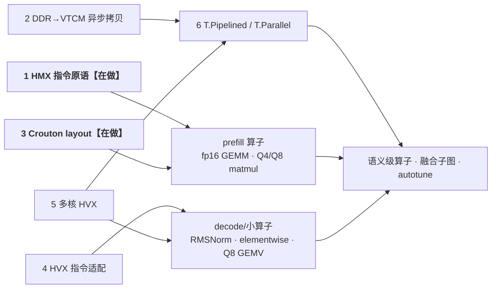
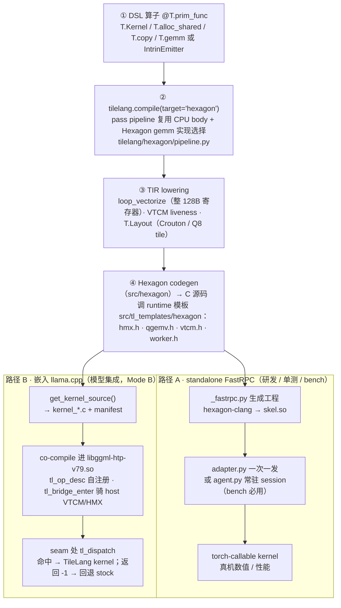
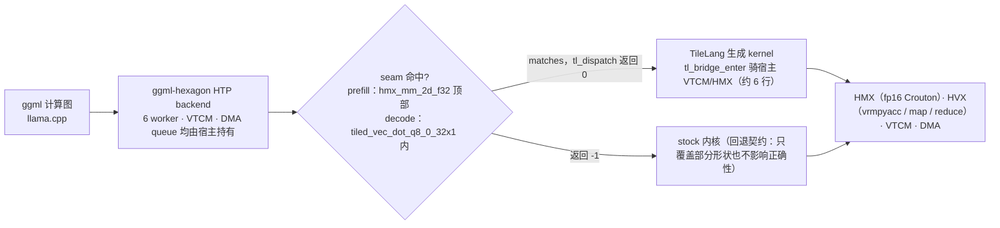
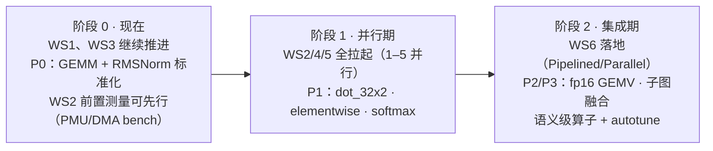

# TileLang × Hexagon 开发计划（v0.3，整体重理版）

日期：2026-08-14。定位：**工作计划主文档** —— 里程碑轴（六大工作流）+ 交付轴（算子矩阵）+ 对接机制 + 排期。

配套文件（算子矩阵以 CSV 为**唯一事实源**，本文表格是快照）：

- 算子矩阵 Excel：[`hexagon_operator_matrix.csv`](hexagon_operator_matrix.csv)（UTF-8 BOM，直接双击打开）
- 分层设计依据：[`tilelang_hexagon_q8_design.md`](tilelang_hexagon_q8_design.md)（L0–L4 边界与 Q8 复核）
- 算子来源：[`lfm2_1.2b_compute_graph.md`](lfm2_1.2b_compute_graph.md)（LFM2-1.2B 真实计算图）
- 对接 walkthrough：[`lfm2_hexagon_report/tilelang_operator_integration.md`](lfm2_hexagon_report/tilelang_operator_integration.md)

---

## 0. 总览

**目标**：TileLang 成为 Hexagon NPU 上可组合、可验证的算子开发面 —— 语义和调度归 TileLang，
指令选择/DMA/资源生命周期归 backend，llama.cpp 只提供资源租约和 op seam。

**路径**：六大硬件适配工作流（§2）是里程碑；算子（§4）是每个工作流的验收交付物；
对接机制（§3）已打通两条部署路径并有模型内 parity 先例。

**现状一句话（2026-08-14 口径）**：

> 工作流 **1（HMX 指令原语）、3（Crouton layout）在做**；**2、4、5 未启动、可随时并行拉起**
> （其中 4、5 已有真机验证件，不是从零）；**6（T.Pipelined/T.Parallel）依赖 2、5**，位于其后。
> 交付侧 P0 = fp16 GEMM + RMSNorm 标准化，两者已有 device-validated example。

**统一验收判据**（贯穿全文）：

| 级 | 内容 | 门限示例 |
|---|---|---|
| **A 数值** | 单算子真机数值 PASS | fp16 max rel err ≤ 1e-3 |
| **B 性能** | microbench 有数字、有对照 | GFLOPS 对 HMX 理论值 / GB/s 对带宽上限 |
| **C 模型** | llama.cpp 模型内 A/B | tok/s ± std、输出 token 一致 |

---

## 1. 背景事实（为什么是这条路径）

硬件（OnePlus PJZ110 · SM8750 · Hexagon v79，实测/手册确认）：

| 单元 | 规格 | 软件含义 |
|---|---|---|
| HVX | 1024-bit 向量 × 6 硬件线程 | decode 主引擎；整 128B 寄存器操作，无子寄存器 |
| HMX | 1 个 fp16 矩阵引擎，32×32 Crouton | prefill 主引擎；M=1 GEMV 无收益（浪费 97% tile） |
| VTCM | 8 MB 软件管理 SRAM | 无自动 cache，显式搬运 + 生命周期管理 |
| DMA | `dmstart/dmlink` 支持 2D stride/padding | 异步搬运的硬件基础（TileLang 侧尚未接入） |
| DDR | LPDDR5X，峰值约 77–85 GB/s（参考值） | decode 上限 = 峰值带宽 / 权重字节 |

Profiling 结论（LFM2-1.2B 实测，决定优先级）：

- 每 decode token 227 个 NPU 算子；**FFN 占 69%**（gate+up 46%、down 23%）、短卷积 15%、注意力 11%。
- 引擎占比：**HVX ≈95%，HMX ≈5%** —— decode 全走 HVX，这是正确的（访存 bound）。
- decode 是**权重带宽 bound**：每 token 全部权重流一遍，算术强度 = 1。

已验证的战略结论（Q8 复核，避免重蹈覆辙）：

1. stock 的 Q8 decode **已有完整流水线**（6 worker、2D DMA、2–16 路预取、VTCM 动态量化）——
   单纯复刻只能 parity（已实证：TileLang Q8 atom 模型内 35.67 ± 0.37 vs stock 35.46 ± 0.17 tok/s）。
2. 要"赢"靠**工作流 2+6（异步搬运 + 调度原语）与融合类算子**（dot_32x2 gate+up、短卷积子图），
   不是再手写一个 stock 复制品。
3. lm_head 放行进 HTP（host 侧 patch）带来约 27% Q8 decode 收益，已并入基线；与 TileLang 无关但影响一切对比口径。
4. nexa 的 69.5 tok/s 是**产品目标参考**，不是严格同口径内核对比。

---

## 2. 里程碑轴：六大工作流

依赖与产出总图（状态：加粗 = 在做）：

并行口径：**1–5 互相不阻塞，可同时开**；6 需要 2 的搬运 lowering 和 5 的 worker/queue 归属先落地。
工作流"完成"的标志不是代码写完，而是**至少一个验收算子借它通过 A/B/C 三级**。

### 2.1 工作流 1：HMX 指令底层原语适配 —— 【在做】

- **范围**：activation/weight load（pack）、convert、mma、bias、acquire/release 等指令 atom 的完整稳定表面。
- **已有基础**：`hmx_intrin.py` 全套 atom（acquire/load_bias/clear/mma/convert/store/release）+ `hmx.h` runtime；
  隐式硬件状态（累加器等）用 1-byte dependency token 表达；最近的 Q4 显式 HMX prefill kernel
  （真机 rel err ≈3.4–3.5e-4）就是本工作流的进行中产物。
- **待办（大纲）**：
  1. atom 表面盘点补齐：load/convert 变体、activation/result 的 spatial-mask 编码、fp32 边界按 32-lane 转换等规则成文；
  2. runtime 债：`hmx.h` static session state → `tl_ctx*`（多个嵌入算子共存的前提）；
  3. 支线调研：HMX 有无 int8 矩阵模式（只影响 prefill 8-bit，不影响 decode 决策）。
- **验收算子**：fp16 GEMM 标准化（P0）→ Q4/Q8 prefill matmul。
- **已知坑**：编译期 SelectionDAG 爆炸（`<64 x i32>` 教训：nibble 类拆解要按 32-lane 分阶段）。

### 2.2 工作流 2：DDR→VTCM 异步拷贝设计 —— 【未启动】

- **范围**：DMA 1D/2D descriptor 的 lowering、双缓冲、per-worker queue 生命周期；
  用户 DSL 不暴露 `dmstart/dmlink` 位域。
- **已有基础**：设计笔记已成文（q8_design 的 L3 方案）；ggml `htp/hex-dma.c` 是完整参考实现
  （2D DMA + padding + 2–16 路预取）；当前 `T.copy` 是同步的。
- **待办（大纲）**：
  1. **前置测量**：换 PMU event set（现集合测不了 AXI read）+ 纯 DMA microbench，校准 DDR 真实 GB/s；
  2. copy lowering 的 1D/2D DMA 选择接口；
  3. queue 归属设计（kernel/session 持有，嵌入时骑宿主 queue）；
  4. 与工作流 6 的 commit/wait hook 对接。
- **验收算子**：fp16 GEMV（M=1，P2）；长期是一切 decode GEMV 的带宽上限。
- **定位**：**decode 能否超越 parity 的决定性一块。**

### 2.3 工作流 3：Crouton layout 适配 —— 【在做】

- **范围**：HMX 要求的 VTCM 32×32 Crouton tile 布局；`T.Layout` 表达 pack/直写；对齐规则（基址 2 KB、bias 256 B）。
- **已有基础**：`T.Layout` 直写 weight Crouton 已在 Q4 kernel 真机验证；`Q8_0TiledLayout`
  （1088 B DDR tile → 1152 B VTCM tile）同一"布局是 ABI"思路。
- **待办（大纲）**：
  1. layout 正式 ABI 化：集中校验对齐/K 倍数、计算 staged buffer 大小，替代零散指针运算；
  2. activation/result Crouton 与 spatial-mask 的编码规则成文；
  3. 与工作流 1 联合由 P0 GEMM 验收。
- **验收算子**：同工作流 1。

### 2.4 工作流 4：HVX 指令适配 —— 【未启动（成体系）· 已有验证件】

- **范围**：逐元素 map、规约 reduce、int8 dot、数学函数（rsqrt/exp 等）的成体系覆盖与接口归一。
- **已有基础**（都已真机 PASS，缺的是系统化）：RMSNorm 的 map + `hexreduce`（sum/max）；
  Q8 `vrmpyacc` dot atom（模型内 parity）；`loop_vectorize` 整 128B 铁律；codegen 识别 `1/sqrtf`。
- **待办（大纲）**：
  1. 指令覆盖清单：map/reduce/dot/math 四族各缺什么，逐项补；
  2. 归约组合成标准用法（softmax 的 max+sum 两段式）；
  3. elementwise 家族算子化（ADD/MUL/SWIGLU，融合储备）；
  4. RMSNorm 补 f32 路径（ggml 图中激活是 f32）。
- **验收算子**：RMSNorm 标准化（P0）→ elementwise/softmax（P1）→ Q8 GEMV 家族。
- **已知坑（三条铁律，违反不崩溃、静默出垃圾）**：最窄 dtype 填满 128B（int8 ≥128 lane）；
  bitwise 前先加宽 int16；DDR 源 ≥128B 对齐。所以测试必须含真机数值。

### 2.5 工作流 5：多核 HVX 处理 —— 【未启动（系统化）· 基础已验证】

- **范围**：6 硬件线程 worker pool 的切分策略、per-worker VTCM slice、与 DMA queue 的配合。
- **已有基础**：`T.Kernel(num_workers=N)` device-validated（`example_worker_pool.py`）；
  stock 的 6-worker × 32-output-row tile 切分是成熟参考。
- **待办（大纲）**：
  1. worker 切分作为可调参数（N-tile 划分策略）；
  2. per-worker VTCM slice 的生命周期管理；
  3. 与工作流 2 的 per-worker queue 归属联合设计。
- **验收算子**：Q8 GEMV `dot_32x2`（P1，接管融合 gate+up —— decode 最大单项 46%）。

### 2.6 工作流 6：调度原语 `T.Pipelined` / `T.Parallel` —— 【未启动 · 依赖 2、5】

- **范围**：把 2（异步搬运）与 5（多核切分）的能力暴露成用户可组合的调度 DSL，
  表达 `prefetch → compute → recycle` 软件流水。
- **已有基础**：q8_design L3 方案 —— 当前 commit/wait 硬编码 `ptx_commit_group/ptx_wait_group`，
  Hexagon `Copy::Lower` 是同步的；改法是先抽 target hook，再接 Hexagon DMA lowering。
- **待办（大纲）**：
  1. commit/wait 抽成 target hook；
  2. `T.Pipelined` 接工作流 2 的异步 copy；
  3. `T.Parallel` 接工作流 5 的 worker 映射；
  4. 收口：语义级 QGEMV（layout/prefetch/worker 数可 autotune）。
- **验收算子**：语义级 QGEMV、短卷积子图融合（P3）。

---

## 3. 对接机制：TileLang 怎么通到硬件

### 3.1 编译 → 部署总览（两条路径共用同一份 DSL 源码）

分工：**A 路把算子做对做快**（验收 A+B），**B 路证明模型里真的赚**（验收 C）。
`get_kernel_source()` 产出的就是裸 `extern "C"` body，无 skel/session 包装，天然可嵌入。

### 3.2 DSL 构件 → 硬件映射（标注所属工作流）

| DSL 构件 | 工作流 | 硬件落点 | 关键约束 |
|---|---|---|---|
| `T.Kernel(..., num_workers=N)` | 5 | 6 个 HVX 硬件线程 worker pool | 执行映射，不是 GPU block；6 是设备上限 |
| `T.alloc_shared` | — | VTCM（8 MB） | 无自动 cache；emitter 内 VTCM tile 必须包 `@T.macro`，否则 liveness 丢失 → 静默垃圾 |
| `T.copy`（现同步） | 2 | HVX 整寄存器拷贝 → 异步 DMA 版待补 | DDR 源 ≥128B 对齐 |
| `T.gemm(..., clear_accum=True)` | 1、3 | HMX fp16 32×32 Crouton | 仅 fp16、维度 32 倍数；必须 `clear_accum`（`mxclracc`），否则 NaN；M=1 无收益 |
| `HMXIntrinEmitter` | 1、3 | HMX 指令 atom | Crouton 地址用 `T.Layout`；隐式状态用 dependency token |
| `Q8GemvIntrinEmitter.dot_32x1` | 4 | HVX `vrmpyacc` int8 点积 | `Q8_0TiledLayout` 是 ABI |
| elementwise `T.serial`/`T.vectorized(128)` | 4 | HVX 1024-bit 整寄存器 | 三条铁律（§2.4） |
| `hexreduce` | 4 | HVX 行归约（sum/max） | stock `T.reduce_sum` 走 fragment，Hexagon 推不了 |
| `T.rsqrt` 等数学函数 | 4 | HVX lane 原语 / scalar | codegen 识别 `1/sqrtf` 模式 |
| （缺）`T.Pipelined` / `T.Parallel` | 6（依赖 2、5） | DMA 2D 双缓冲 + worker 并行循环 | commit/wait 现硬编码 PTX，待抽 hook |

### 3.3 模型内运行时分发（路径 B）

decode seam 特意放在 `dma_queue_pop()` 之后：权重已在 VTCM，TileLang 只接管 dot，
不重复申请资源、不动 stock 流水线 —— 这是 Mode B"骑资源"设计的延伸。

### 3.4 五层边界 ↔ 工作流对应

| 层 | 内容 | 归属 | 对应工作流 |
|---|---|---|---|
| L0 语义 op | `y = dequant(W) @ quantize(x) + bias` 级数学 | TileLang | 六项全落地后的完整体 |
| L1 目标布局 | Crouton、`Q8_0TiledLayout`（布局是 ABI） | backend | **3** |
| L2 指令 atom | `tl_hexagon_*` 模板承载不可拆指令序列 | backend | **1**（HMX）、**4**（HVX） |
| L3 流水线 lowering | prefetch→compute→recycle 双缓冲 | backend | **2** + **6**（DSL 表面） |
| L4 宿主资源租约 | standalone 自建 session / 嵌入骑宿主资源 | 分界协议 | **5**（queue/worker 归属）+ bridge |

> 判据：TileLang 拥有算子语义和调度；backend 拥有指令选择、DMA lowering、资源生命周期；
> llama.cpp 只提供资源租约和稳定 seam。任何跨界先用模型 A/B 证明必要性。

---

## 4. 交付轴：算子矩阵（快照，全量见 CSV）

### 4.1 已验证盘点

| 算子/组件 | 工作流 | 引擎 | 证据 |
|---|---|---|---|
| fp16 GEMM（`T.gemm`） | 1、3 | HMX | 真机数值 PASS；同路径 Q4 融合版曾 prefill parity（`example_matmul.py`） |
| HMX 指令 atom（手驱 K-loop） | 1、3 | HMX | Q4 显式版真机 rel err ≈3.5e-4（`example_qmatmul_kstream.py`） |
| RMSNorm | 4 | HVX | 真机 PASS，0.05 abs 判据待收紧（`example_rmsnorm.py`） |
| FlashAttention（prefill） | 1、3、4 | HMX+HVX | 真机验证 example |
| Q4_0 fused matmul（prefill） | 1、3、4 | HMX | correctness PASS；性能 2.85 vs 590 t/s，feature 默认关闭 |
| Q8_0 GEMV atom `dot_32x1` | 4 | HVX | 真机 PASS + **模型内 parity**（35.67 ± 0.37 vs 35.46 ± 0.17 tok/s） |
| worker pool（6×HVX） | 5 | — | device-validated 基础设施 |

### 4.2 开发矩阵

| P | 算子 | 工作流 | 阶段 | LFM2 位置·形状 | 状态 |
|---|---|---|---|---|---|
| **P0** | **GEMM fp16 标准化** | **1、3** | prefill | 全部 MUL_MAT（2048→{6144, 2048, 8192, 512}、8192→2048） | example→算子 |
| **P0** | **RMSNorm 标准化**（含 f32 路径） | **4** | 两者 | 每层 attn/ffn_norm（N=2048）+ per-head（N=64）+ 收尾 | example→算子 |
| P1 | Q8 GEMV `dot_32x2`（融合 gate+up） | 4、5 | decode | ffn_gate+up 2048→8192×2（decode 46%） | 未开始 |
| P1 | elementwise：ADD / MUL / SWIGLU | 4 | 两者 | 残差、门控、激活（融合储备） | 未开始 |
| P1 | Softmax 独立算子化 | 4 | 两者 | 从 FlashAttention basis 抽取 | 抽取 |
| P2 | RoPE | 4 | 两者 | attn 6 层的 Q、K | 未开始 |
| P2 | SSM_CONV 短卷积 | 4 | 两者 | conv 10 层，kernel=3 | 未开始 |
| P2 | fp16 GEMV（M=1） | 2、4、5 | decode | F16 模型全部 MUL_MAT；上限取决于工作流 2 | 未开始 |
| P3 | 短卷积子图融合 in_proj→SSM_CONV→out_proj | 2、4、5、6 | decode | 唯一未被 ggml 融合的子图（15%），中间量驻 VTCM | 未开始 |
| P3 | lm_head GEMV | 4、5 | decode | 2048→65536；host 上限 patch 已验证并入基线 | host 侧已解决 |

### 4.3 明确不做（有理由，可复议）

| 算子 | 理由 |
|---|---|
| SET_ROWS / CPY(KV cache 写) | 纯搬运，profiling 非瓶颈，ggml 已高效 |
| CONCAT(conv state 拼接) | 同上 |
| GET_ROWS(embedding 查表, q6_K) | CPU 侧查表，量小；lm_head 已单列 P3 |

---

## 5. 排期与执行

### 5.1 三个阶段（与工作流口径对齐）

阶段边界的判据：阶段 0 → 1 = P0 两算子过 A+B、checklist 成文；
阶段 1 → 2 = WS2 的 DMA lowering 和 WS5 的 queue/worker 归属可用（WS6 的两个前置）。

### 5.2 P0 详细工作项（example → 标准算子）

起点：两算子已有可跑真机的 example（`example_matmul.py`、`example_rmsnorm.py`），P0 是标准化不是从零写。

1. **算子工厂与约束显式化**：`make_gemm(M,N,K,block,dtype)` / `make_rmsnorm(M,N,eps,dtype)`；
   非法形状（非 32/64 倍数）编译期报清晰错误，不留到设备上静默出错。
2. **RMSNorm 补 f32 路径**：ggml 图中 RMS_NORM 激活是 f32；两种精度都过数值。
3. **测试入库**：`testing/python/hexagon/` 加 `test_gemm_f16.py`、`test_rmsnorm.py`
   （离线 codegen 断言 + 真机数值，照 `test_tilelang_qgemv.py`）。
4. **microbench 基线**：走 `agent.py` 常驻 session（单次墙钟被 FastRPC marshal 主导，必须摊薄）。
   GEMM 记 GFLOPS 对 HMX 理论；RMSNorm 记 GB/s 对 VTCM/HVX copy 上限；数字落 docs。
5. **沉淀《算子接入 checklist》**：语义→布局→约束→测试→bench→文档 模板页，P1 起复用。
6. （可选）RMSNorm 走路径 B 做模型内 A/B —— RMS_NORM 是独立 ggml op，seam 好找，
   可成为"非 matmul 算子走通 Mode B"第一例。

选这两个打样的理由：GEMM 盖 HMX+Crouton 主干道（= 工作流 1+3 的验收），RMSNorm 盖 HVX
map+reduce 主干道（= 工作流 4 的拉起），且都无量化复杂度，适合锤炼流程本身。

边界提醒：fp16 **GEMV（M=1）不在 P0** —— 访存 bound，是压工作流 2/4/5 的另一个算子（P2）；
拿 HMX GEMM 盖 M=1 是已知反模式。

---

## 6. 风险与开放问题（跨切面）

1. **parity 陷阱**：stock decode 流水线已完整，无 WS2+WS6 的 decode 算子只能 parity —— 排期上别把
   "写完 kernel"当成"有收益"。
2. **带宽测量方法学**：现 PMU event set 测不了 AXI read；`模型大小 × tok/s` 不能代替 DDR 测量。
   WS2 前置测量先行（可在阶段 0 启动）。
3. **多算子共存**：`hmx.h` static session state；两个以上嵌入算子前必须完成 `tl_ctx*` 重构（WS1 名下）。
4. **环境迁移**：仓库已迁 macOS（`/Users/xwh/tilelang-hexagon`），历史文档 `/home/xwh` 的
   toolchain/设备命令需按 [`hexagon_env_setup.md`](hexagon_env_setup.md) 重新对齐。
5. **口径提醒**：nexa 69.5 tok/s 是产品目标参考；严格对比一律用本机 A/B（同模型、同命令、±std）。

---

## 7. 变更记录

- **v0.3（2026-08-14）**：整体重理。六工作流升为主干（每工作流独立小节：范围/状态/基础/待办/验收）；
  新增背景事实与三阶段排期；"不做"清单落地；CSV 重构为唯一事实源（验收拆 A/B/C 三列，加负责人列）。
- v0.2：加入六工作流轴（1、3 在做；2/4/5 可并行；6 依赖 2、5）。
- v0.1：算子矩阵 + 流程图 + P0 计划初版。
